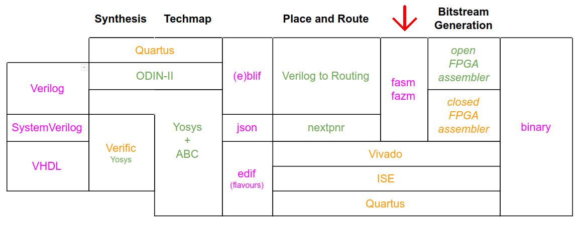

## FPGA Assembly (FASM) Parser and Generation library

This repository documents the FASM file format and provides parsing libraries and simple tooling for working with FASM files.

It provides both a pure Python parser based on `textx` and a significantly faster C parser based on `ANTLR`. The library will try and use the ANTLR parser first and fall back to the `textx` parser if the compiled module is not found.

Which parsers are supported by your currently install can be found via `python3 -c "import fasm.parser as p; print(p.available)`. The currently in use parser can be found via `fasm.parser.implementation`.

It is highly recommended to use the ANTLR parser as it is about 15 times faster.

functions for parsing and generating FASM files.

## Build Instructions

CMake is required, and ANTLR has a few dependencies:

    sudo apt install cmake default-jre-headless uuid-dev libantlr4-runtime-dev

Pull dependencies in `third_party`:

    git submodule update --init

Build:

    make build

Test with:

    python setup.py test

## FPGA Assembly (FASM)

FPGA Assembly is a file format designed by the
[SymbiFlow Project](https://symbiflow.github.io) developers to provide a plain
text file format for configuring the internals of an FPGA.

It is designed to allow FPGA place and route to not care about the *actual*
bitstream format used on an FPGA.

### Properties

 * Removing a line from a FASM file leaves you with a valid FASM file.
 * Allow annotation with human readable comments.
 * Allow annotation with "computer readable" comments.
 * Has syntactic sugar for expressing memory / lut init bits / other large
   arrays of data.
 * Has a canonical form.
 * Does not require any specific bitstream format.

### Supported By

FASM is currently supported by the
[SymbiFlow Verilog to Routing fork](https://github.com/SymbiFlow/vtr-verilog-to-routing),
but we hope to get it merged upstream sometime soon.

It is also used by [Project X-Ray](https://github.com/SymbiFlow/prjxray).
